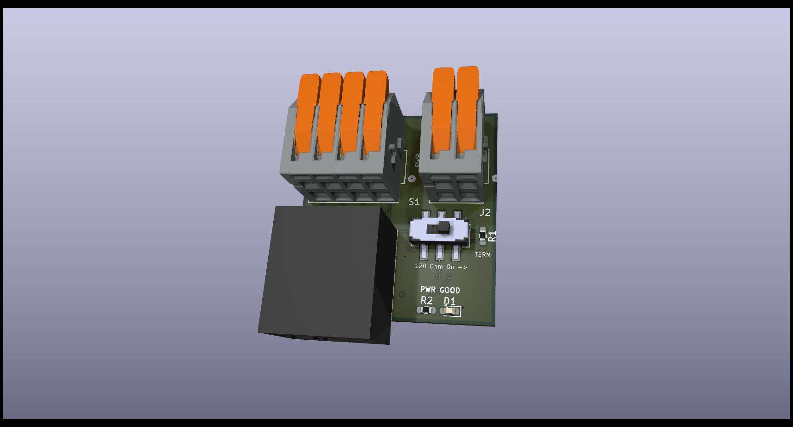
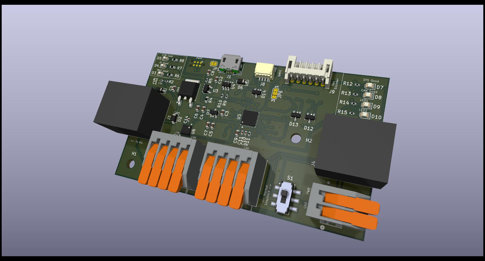
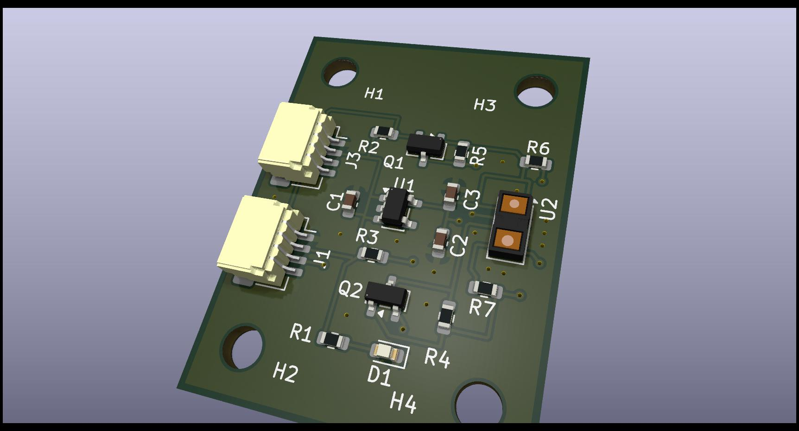
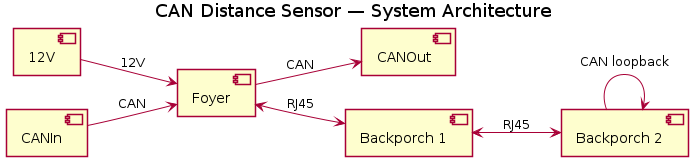
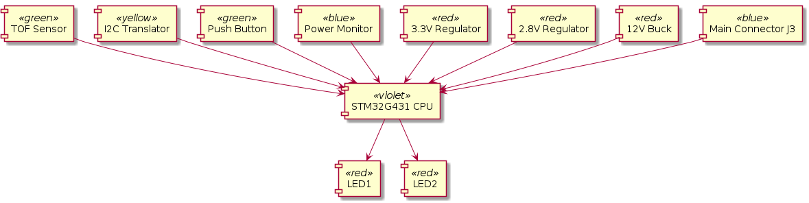

# Foyers / BackPorch Project

The Foyers/BackPorch system is an STM32-based hardware ecosystem designed for FRC robot sensing and control, featuring CAN communication with a built-in bootloader.



## Hardware Overview

### Foyer Distribution Board
The Foyer board serves as the primary distribution point for the system. 
- **Power & CAN Input**: Connects to the main robot power and CAN bus.
- **Power & CAN Exit**: Provides a pass-through for daisy-chaining CAN and power to subsequent devices.
- **Node Interface**: Distributes power and CAN to the BackPorch and sensor nodes.

### BackPorch Main Board
The BackPorch is the central controller board, based on the STM32G0B1 microcontroller. It handles high-level CAN communication, sensor aggregation, and basic power management.



#### Main Connectors & Pinouts

| Ref | Type | Function | Mating Part |
| --- | --- | --- | --- |
| **J4** | RJ45 | CAN Bus | Standard RJ45 Plug |
| **J9** | JST PH 6-pin | Rev Through Bore Encoder | JST PHR-6 |
| **J10** | USB Micro B | Power / Debug | Standard Micro-USB |
| **J1/J2**| Wago 2601 | Power Input (VBAT/GND) | 24-16 AWG Wire |
| **J3** | Wago 2601 | Motor Output | 24-16 AWG Wire |
| **J6** | Tag-Connect | SWD Programming | TC2030-IDC |

**J4 (RJ45) CAN Pinout:**
- **Pin 1**: CAN High
- **Pin 2**: CAN Low
- **Pin 3**: CAN High Loopback
- **Pin 4**: VBAT
- **Pin 5**: VBAT
- **Pin 6**: Can Low Loopback
- **Pin 7**: GND
- **Pin 8**: GND

**J9 (Rev Through Bore Encoder) Pinout:**
Compatible with the [REV Through Bore Encoder](https://docs.revrobotics.com/rev-crossover-products/sensors/tbe).
- **Pin 1**: 5V Power
- **Pin 2**: Absolute Position (Duty Cycle)
- **Pin 3**: Incremental Channel A
- **Pin 4**: Incremental Channel B
- **Pin 5**: Index (Optional)
- **Pin 6**: GND

### SimpleTOF Board
A compact Time-of-Flight (ToF) distance sensor breakout designed to interface with the BackPorch.



## Software Setup

### Development Environment
This project uses the official STM32 development workflow:

1.  **STM32CubeMX**: Used for low-level hardware configuration (GPIO, CAN, Timers).
    - Open the `.ioc` files in the `software/backporch` or `software/bootloader` directories to modify the hardware configuration.
    - Generate code to update the underlying HAL drivers.
2.  **Visual Studio Code**: The recommended IDE for code development.
    - Use the **STM32 VS Code Extension** to compile the project.
    - Ensure `arm-none-eabi-gcc` is installed and in your PATH.
    - Build using the `CMake` workflow provided by the extension.

## Bootloader & Monitoring Utility

The `software/can_mon/bp_debug.py` program is a multi-purpose Python utility for interacting with the hardware over CAN.

### Script Purpose
- **CAN Monitor**: Provides a real-time GUI to view telemetry from discovered devices (Voltage, Current, Temp, Distance, Encoder position).
- **Firmware Updater**: Acts as the host tool for the CAN bootloader, allowing you to stream `.bin` files to a target device ID and commit them to flash.
- **Status Broadcasts**: Decodes the WPILib-formatted CAN frames used by the system.

### Usage
```bash
python software/can_mon/bp_debug.py
```
*Note: Requires `python-can` and `tkinter` libraries. Ensure your CAN adapter is configured (default: SLSAN on COM5).*

## System Architecture



The system follows a modular architecture where multiple sensor nodes (Foyers) communicate with the BackPorch controller over a shared CAN bus, which then interfaces with the Robot Controller.


These are similar to the SWYFT CAN wiring devices
